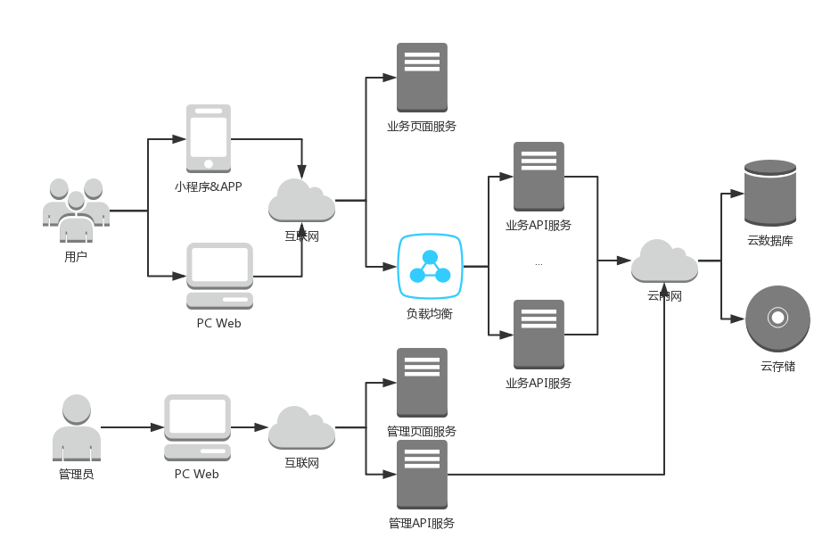

### 系统架构

#### 系统架构图

#### 系统Git项目结构
 - 服务端: Gecko
   - GeckoClientServer：客户相关API服务
   - GeckoProviderServer: 服务商相关API服务
   - GeckoAdminServer: 管理服务API服务
 - 微信小程序: GeckoWxApp
   - GeckoClientWxApp: 微信小程序客户版
   - GeckoProviderWxApp: 微信小程序服务商版
 - PC端WEB页面: GeckoWeb
   - GeckoAdminWeb: 管理PC WEB单页面应用
   - GeckoClientWeb: 客户PC WEB 多页面应用
    - index.html 首页
    - company.html 企业管理页面
   - GeckoProviderWeb: 服务商服务管理页面
